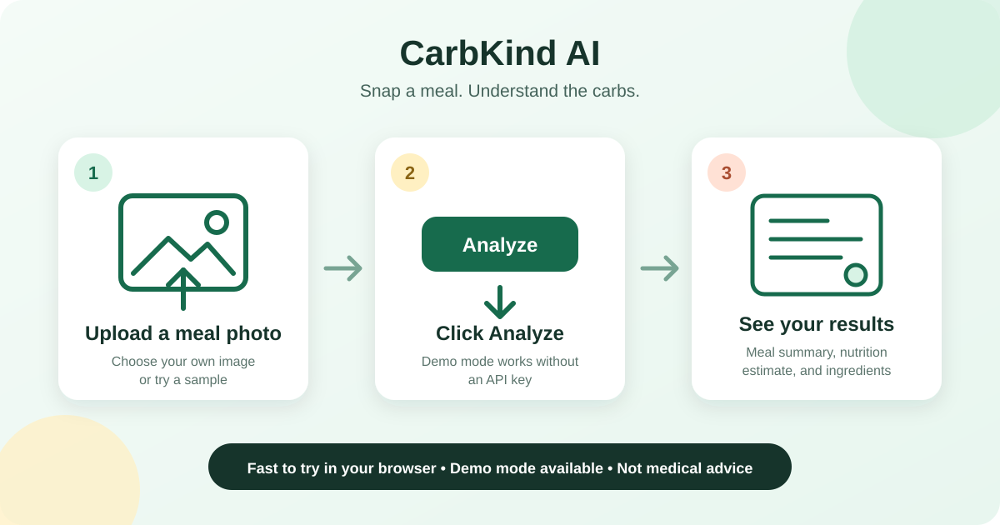

# CarbKind AI 🥗

CarbKind AI is a safety-gated multimodal food-photo assistant that helps users understand a meal's approximate nutrition, carb load, ingredients, and practical portion guidance through a simple consumer-friendly interface.

CarbKind AI pairs a dark, consumer-friendly food-photo interface with a simple nutrition summary, carb estimate, ingredient list, and practical portion guidance.



## What it does

CarbKind AI turns a meal photo into an understandable estimate of its ingredients and nutritional content. Its output is structured so it can be checked, displayed, and safely qualified before it reaches a user.

## Why this project exists

Nutrition information from an image is inherently uncertain. This project explores how multimodal AI, explicit safety checks, and clear uncertainty language can make image-based meal guidance more useful and responsible.

## Try it quickly

The Gradio app accepts a meal image and displays a validated response with estimated ingredients, nutrition, uncertainty notes, and safety-reviewed guidance. It runs in deterministic demo mode by default, with an optional live model pipeline for local use.

Run the local Gradio demo:

```bash
python app.py
```

Demo mode works without an API key. You can upload your own meal photo or click one of the public demo images in [`examples/sample_images/`](examples/sample_images/).

## Demo mode vs live mode

Demo mode is the default. It works without an API key, makes no model requests, and returns the included sample structured response.

In demo mode, the uploaded image is not analyzed; the app returns a fixed sample response so the interface can be tested without an API key.

Live mode requires an `OPENAI_API_KEY` and runs three model-backed steps: image guardrail, meal analysis, and output safety review. To enable it:

1. Copy `.env.example` to `.env`.
2. Set `DEMO_MODE=false`.
3. Set `MODEL_PROVIDER=openai`.
4. Set `OPENAI_API_KEY` to your key.
5. Run `python app.py`.

Keep `.env` local and never commit it. Model names can be changed independently with the model environment variables shown in `.env.example`.

## Architecture

The system separates image intake, input guardrails, meal analysis, structured Pydantic validation, and output safety review into focused components. Runtime orchestration connects those components while keeping configuration and evaluation utilities isolated.

## Model providers

The analysis pipeline uses a small provider contract so model backends can change without changing the app response format.

When `DEMO_MODE=true`, the demo provider is always used. When it is `false`, `MODEL_PROVIDER` selects the backend.

Current providers:

- `demo`: loads a fixed sample response and requires no API key.
- `openai`: runs the live multimodal guardrail, meal-analysis, and safety-review flow and requires `OPENAI_API_KEY`.

Planned providers include a Qwen or other open-source VLM experiment and a local or lightweight model option. These planned providers are not implemented yet.

## Evaluation

Run the public-safe demo evaluation:

```bash
python scripts/eval_provider.py
```

This checks structured output, safety wording, and carb-aware fields using the repository's public-safe sample images. It does not print raw responses or report benchmark scores.

Live OpenAI evaluation requires explicit opt-in and a configured environment:

```bash
python scripts/eval_provider.py --provider openai --allow-live
```

## Quickstart

```bash
conda activate py312
pip install -r requirements.txt
cp .env.example .env
python app.py
```

You can also start the demo with `gradio app.py` after installing the dependencies.

## Environment variables

- `DEMO_MODE`: Defaults to `true`; set to `false` to request live analysis.
- `MODEL_PROVIDER`: Defaults to `demo`; currently supports `demo` and `openai`.
- `OPENAI_API_KEY`: Required when `DEMO_MODE=false` and `MODEL_PROVIDER=openai`.
- `OPENAI_GUARDRAIL_MODEL`: Model used for the input guardrail.
- `OPENAI_MEAL_MODEL`: Model used for meal analysis.
- `OPENAI_SAFETY_MODEL`: Model used for output safety review.

Copy `.env.example` to `.env` for local configuration. Never commit API keys or other secrets.

## Repository structure

```text
.
├── app.py                  # Runnable Gradio demo
├── src/
│   ├── agents/             # Providers, prompts, schemas, and agent pipeline
│   ├── runtime/            # Response construction helpers
│   ├── utils/              # Shared utilities
│   └── evals/              # Public evaluation utilities
├── examples/               # Public demo response, images, and screenshots
├── docs/                   # Extended project documentation
└── notebooks/              # Public exploration notebooks
```

## Safety note

Nutrition estimates are approximate and are not medical advice. Outputs communicate uncertainty and pass through a dedicated safety-review step, but they should not replace guidance from a qualified healthcare professional.

## Roadmap

- Publish openly licensed sample images and example outputs.
- Add evaluation coverage and deploy the Gradio demo.

### Product and ML vision

CarbKind AI is designed as more than a one-off meal analyzer. The longer-term direction is a personalized, carb-aware food assistant that can learn from user-owned meal photos, decompose meals into ingredients, suggest practical substitutions, and eventually compose healthier meals from what a user already has available.

- [Product vision](docs/product_vision.md)
- [ML roadmap](docs/ml_roadmap.md)
- [Personalization and recipe factorization](docs/personalization_and_recipe_factorization.md)

### Ingredient-factorization prototype

The repository includes an early, deterministic ingredient-role and meal-composer prototype. It uses no model calls or stored user data:

```bash
python scripts/demo_meal_composer.py
```

The Gradio app exposes both workflows:

- **Photo Analyzer:** upload a meal image for the existing analysis experience.
- **Meal Composer:** enter available ingredients for a rule-based, carb-aware meal idea.

See the [personalization implementation plan](docs/personalization_implementation_plan.md) for its current limits and staged development path.

## License

This project is available under the [MIT License](LICENSE).
