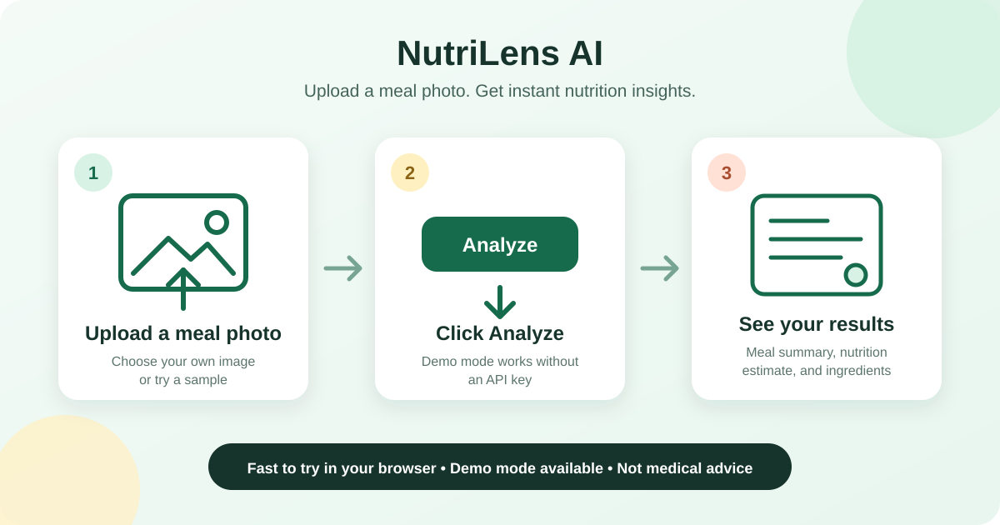

# NutriLens AI 🥗

NutriLens AI is a safety-gated multimodal AI-agent system that analyzes meal images, estimates nutrition and ingredients, and returns structured, safety-reviewed meal guidance.

NutriLens AI is designed to make meal analysis feel simple and consumer-friendly: upload a food photo, get a clear nutrition summary, carb estimate, and practical portion guidance.



## What it does

NutriLens AI is being designed to turn a meal photo into an understandable estimate of its ingredients and nutritional content. Its output will be structured so it can be checked, displayed, and safely qualified before it reaches a user.

## Why this project exists

Nutrition information from an image is inherently uncertain. This project explores how multimodal AI, explicit safety checks, and clear uncertainty language can make image-based meal guidance more useful and responsible.

## Try it quickly

The Gradio app accepts a meal image and displays a validated demo-mode response with estimated ingredients, nutrition, uncertainty notes, and safety-reviewed guidance. The current public version runs in demo mode and returns a sample structured meal analysis. Live model mode is planned next.

Run the local Gradio demo:

```bash
python app.py
```

Demo mode works without an API key. You can upload your own meal photo or click one of the public demo images in [`examples/sample_images/`](examples/sample_images/).

Live Hugging Face Space coming soon.

## Planned architecture

The planned system separates image intake, meal analysis, structured output validation, and safety review into focused components. Runtime orchestration will connect those components while keeping configuration and evaluation utilities isolated.

## Quickstart

```bash
python -m venv .venv
source .venv/bin/activate
pip install -r requirements.txt
cp .env.example .env
python app.py
```

You can also start the demo with `gradio app.py` after installing the dependencies.

## Environment variables

- `DEMO_MODE`: Keep set to `true` to run the scaffold without an API key.
- `OPENAI_API_KEY`: Optional for now; reserved for a future connected analysis pipeline.
- `OPENAI_GUARDRAIL_MODEL`: Model used for the planned input guardrail.
- `OPENAI_MEAL_MODEL`: Model used for the planned meal analysis.
- `OPENAI_SAFETY_MODEL`: Model used for the planned output safety review.

Copy `.env.example` to `.env` for local configuration. Never commit API keys or other secrets.

## Repository structure

```text
.
├── app.py                  # Runnable Gradio demo
├── src/
│   ├── agents/             # Response schemas and demo pipeline
│   ├── runtime/            # Response construction helpers
│   ├── utils/              # Shared utilities
│   └── evals/              # Public evaluation utilities
├── examples/               # Public demo response, images, and screenshots
├── docs/                   # Extended project documentation
└── notebooks/              # Public exploration notebooks
```

## Safety note

Nutrition estimates are approximate and are not medical advice. Future outputs will communicate uncertainty and use a dedicated safety-review step, but they should not replace guidance from a qualified healthcare professional.

## Roadmap

- Add the multimodal analysis pipeline.
- Add input guardrails and output safety review.
- Publish openly licensed sample images and example outputs.
- Add evaluation coverage and deploy the Gradio demo.

## License

This project is available under the [MIT License](LICENSE).
