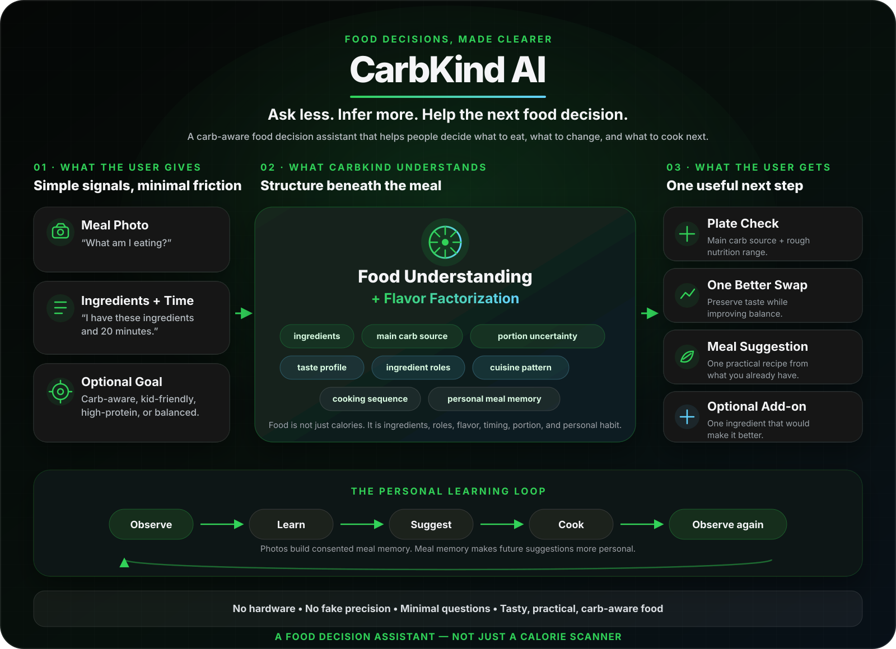

# CarbKind AI



CarbKind AI is a mobile-first, carb-aware food decision assistant. It helps users understand what they are eating, identify the main carb source, and decide what to make next from ingredients they already have.

**CarbKind does not try to measure food perfectly; it tries to help people make the next better food decision.**

## What CarbKind answers

- “I am eating this. What should I know?”
- “I have these ingredients and 20 minutes. What should I make?”
- “How can I make this meal more carb-aware without making it boring?”

## What it is not

- Not a medical device.
- Not a replacement for a clinician or dietitian.
- Not an exact calorie tracker.
- Not dependent on hardware, food scales, or special sensors.

Nutrition and ingredient estimates are approximate and are not medical advice. CarbKind communicates uncertainty, avoids medication guidance, and treats useful ranges as more honest than fragile precision.

## Current experience

The Gradio app presents two focused workflows:

- **Photo Analyzer:** turns a meal photo into a safety-reviewed summary with likely ingredients, a rough nutrition range, the main carb source, and practical portion context.
- **Meal Composer:** turns available ingredients into a deterministic, carb-aware meal idea with functional substitutions. It makes no model call and stores no user data.

The project currently includes:

- Photo Analyzer and Meal Composer
- Deterministic demo provider
- Live OpenAI provider
- Optional Qwen provider scaffold
- Public eval harness
- Ingredient-role and functional-substitution foundation

## Try it locally

CarbKind uses the existing conda environment `py312`:

```bash
conda activate py312
pip install -r requirements.txt
cp .env.example .env
python app.py
```

Demo mode is the default, needs no API key, and makes no model requests. You can upload a photo to preview the interface or use a public image from [`examples/sample_images/`](examples/sample_images/); demo output remains deterministic.

## Providers

The analysis pipeline uses a small provider contract while preserving one validated response format and safety boundary.

- `demo`: fixed public sample response with no API call.
- `openai`: live multimodal guardrail, meal analysis, and safety review; requires explicit configuration.
- `qwen`: optional experimental scaffold for future local VLM work; disabled by default and never downloads weights automatically.

When `DEMO_MODE=true`, the demo provider is always used. With demo mode disabled, `MODEL_PROVIDER` selects `openai` or optional `qwen`. See [.env.example](.env.example) and the [Qwen provider guide](docs/qwen_provider.md) for configuration details.

## Public evaluation

Run the public-safe demo evaluation:

```bash
python scripts/eval_provider.py
```

Run the rule-based Meal Composer example:

```bash
python scripts/demo_meal_composer.py
```

The eval harness checks response structure, safety wording, and carb-aware fields against public sample images. Live evaluation requires explicit opt-in and local configuration.

## The longer-term loop

CarbKind is designed to connect three capabilities:

1. **Photo Analyzer** understands what a person chooses to eat.
2. **Personal Meal Memory** stores only consented, structured food patterns.
3. **Meal Composer** uses current ingredients, available time, and a confirmed profile to suggest what to cook next.

Over time, consented meal photos can help identify recurring foods, avoided ingredients, cuisine patterns, and common carb sources. The intended loop is:

```text
observe → learn → suggest → cook → observe again
```

Personalization remains user-controlled: inferred preferences should be confirmed before they become strict constraints, and meal history should support clear retention and deletion controls.

## Project docs

- [Product vision](docs/product_vision.md)
- [Product principles](docs/product_principles.md)
- [Product backlog](docs/product_backlog.md)
- [ML roadmap](docs/ml_roadmap.md)
- [Evaluation methodology](docs/eval_methodology.md)
- [Personalization implementation plan](docs/personalization_implementation_plan.md)
- [Qwen provider guide](docs/qwen_provider.md)

## License

This project is available under the [MIT License](LICENSE).
